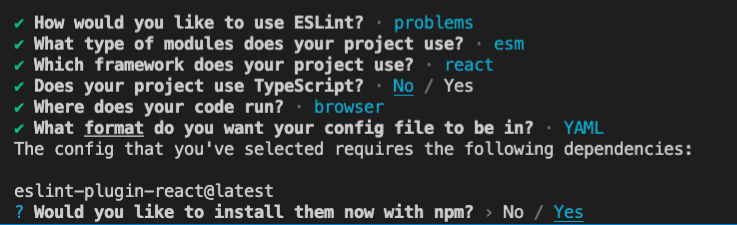
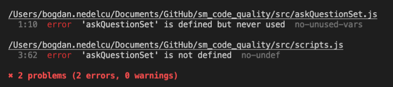

# Action Item: Quality Built-in

## Setup

In this case we are just using some js code as example. 
You can apply the following setup to any JS code base.

## 1. Setting up a linter

1. To use different packages we need to setup the package manager - `npm` in this folder:
    ```bash 
    npm init -y
    ```
------
2. Add a `.gitignore` file to leave the `node_modules` out of your commits:
    ```bash 
    echo "node_modules" > .gitignore 
    ```
    **Save the `.gitignore` file with the code editor to apply the changes.**
------
3. Add `eslint` as a development dependency by running:
    ```bash 
    npm install eslint --save-dev
    ```
------
4. Add a `lint` script to the `package.json` file that will lint the code:
    ```javascript 
      "scripts": {
            ...,
            "lint": "eslint . --fix"
        },
    ```
------
 5. Run the Command Line Initialization script of `eslint`:
    ```bash
    npm run lint -- --init
    ```

    Follow the dialog in the terminal to complete the linter setup. A linter file and all the dependencies will be added depending on your preferences.
    This are the options chosen in this blueprint:
    

------
 6. Run the linter:
    ```bash
    npm run lint
    ```

    You should get at least two linter errors that look like this:
    
    *Don't worry about them now, we will fix them later.*
------

 7. Install the `elint` extension for your code editor:

    ##### [ESLint for VS Code](https://marketplace.visualstudio.com/items?itemName=dbaeumer.vscode-eslint)
    
------


## 2. Setting up git hooks 

1. Install husky -- easily setup of Git Hooks:
    ```bash 
    npm install husky --save-dev
    ```
------
2. Add a `prepare` script to the `package.json` file that will setup `husky`:
    ```javascript 
      "scripts": {
            ...,
            "prepare": "husky install"
        },
    ```
------
3. Run the prepare script to setup `husky`:
    ```bash 
    npm run prepare
    ```
------

4. Add a hook to run the linter on every commit:
    ```bash 
    npx husky add .husky/pre-commit "npm run lint"
    ```

------

5. Add and commit you code and check the linter runs automatically:
    ```bash 
    git add .
    git commit -m "feat: added linter on commit"
    ```
    The commit should fail as the linter does not passed. Congratulations! You setup code quality with a standard linter style on each commit!
----


## Wrapping up

1. Make sure you push and commit your code
2. Feel free to take the exercise further and experiment yourself with the setup

### Made with :orange_heart: in Berlin by @CodeWithDragos
